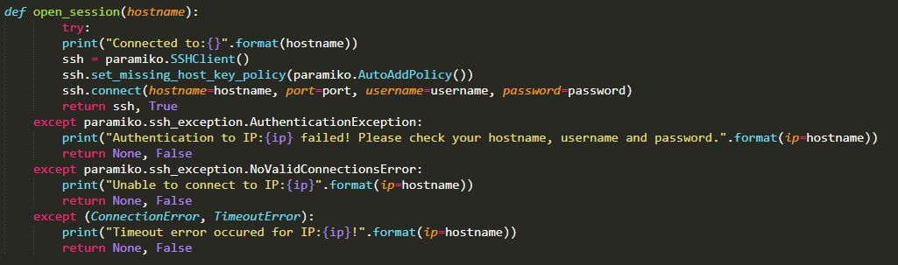
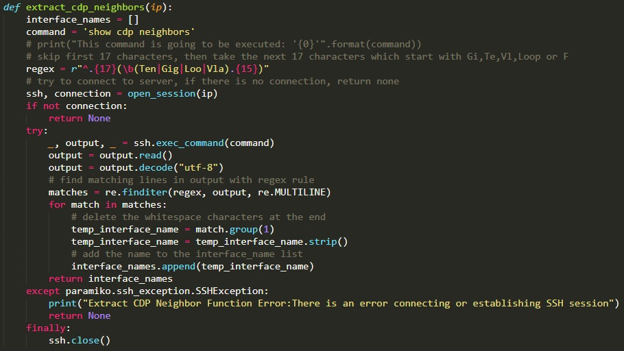
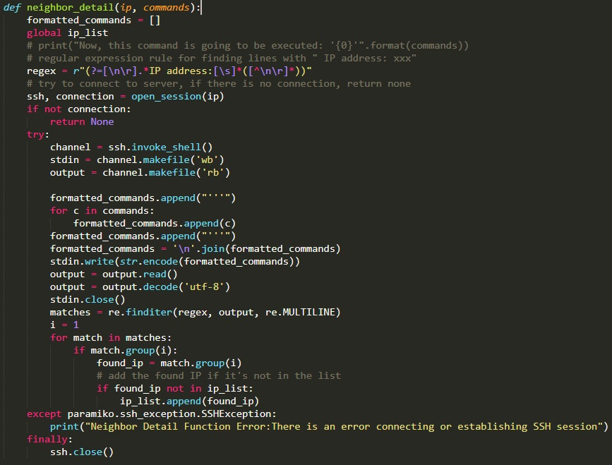
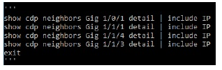
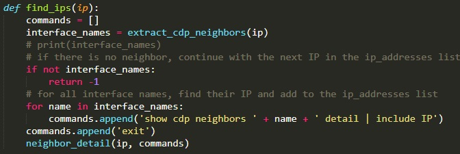
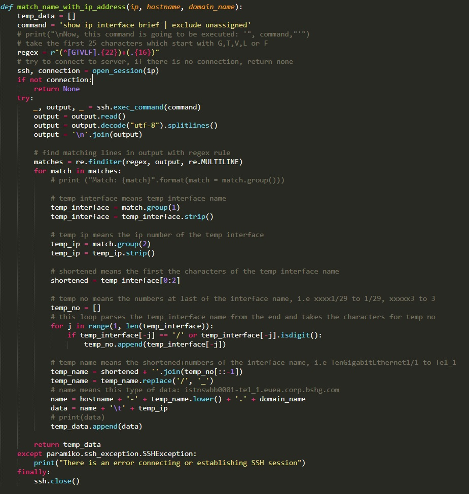
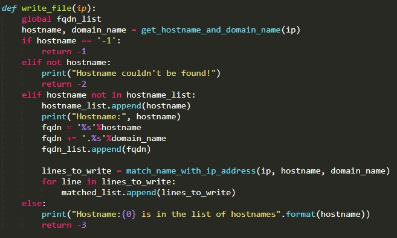
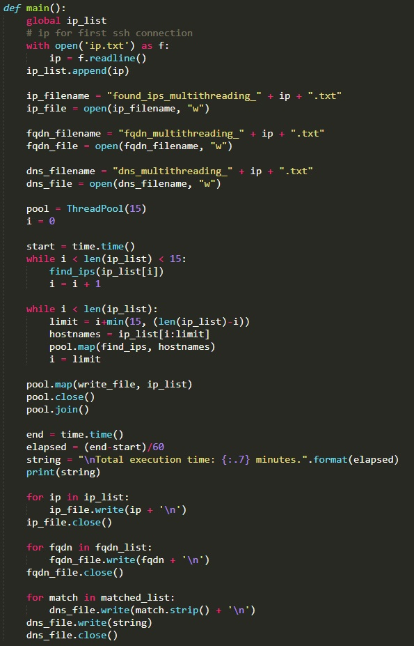

# CDP Neighbor Discovery

The developed project is to implement the network automation, which is now trending, in the existing system and make the tasks easier. In the first part of this project, Python script is traversing all Cisco Network Devices with the help of Cisco Discovery Protocol (CDP). CDP shows all the neighbor devices that connected. After neighbors are found and their IPs are known, hostname-IP matching is applied and written to the file for all IPs in the second part of the project. Besides that, in the second part, fully qualified domain names (FQDNs) are also written to a different file.

As it has mentioned above, CDP is a powerful protocol because it helps the user to find information about neighbor devices of a device. Therefore, it is possible to reach details of a device from its neighbors. 

### First Part

This function is implemented in order to SSH Connection to a device. Paramiko library, i.e. a Python library for SSH, is used for SSH Connection. Function tries to connect with given hostname, port number, username and password. If there is an error, exceptions occurs and function returns false. Possible exceptions, i.e. Authentication exception, No valid connection, Timeout error, were tested and added to the exceptions. When an exception occurs, it print outs why connection failed.

This function firstly calls open_session function in order to connect the given IP. If connection is successful, it tries to execute “show cdp neighbors” command with exec_command() function of Paramiko library. Since it returns output as bytes, it is read and decoded to string. After the conversion from bytes to string, Regular Expression, “re” library of Python is used for capturing interface names from the output. First seventeen characters are skipped and then the lines which contain the words that start with Gi, Te, Vl, Loop or F are found. These are first two characters of the possible interface names. Thus, the next fifteen characters are taken and added to the list of interface_name. re.finditer finds matching lines in the output with the regular expression rule. Function returns this list. Possible exception for this function is SSH exception. Therefore, try/except is used for implementation.

Neighbor_detail() takes one extra parameters rather than taking only an IP to connect, it takes “commands” parameter because it executes multiple line of commands when SSH connection is successful to an IP, i.e. Cisco Network Device. Find_ips(), the main function of this part of the project, creates these commands. It firstly connects to the device, and then tries to open an interactive shell. Paramiko’s invoke_shell() function does this job. When shell is opened, stdin, and output are directly connects to the device. So, commands are written to the input with this format (The variable“formatted_commands” has a string with this format):

As it explained before, byte to string conversion is necessary for applying regular expression to the output. This time, regular expression matches the lines with " IP address: xxx" and takes the IP addresses from that matches. After the IP address is found, it is added to the list if it is not in the list of discovered IPs.

Find_ips() is the main function of this part of the project. It runs extract_cdp_neigbors() function and takes all the interface names. If interface names list is empty, function returns -1. If function continues to run, it creates “show cdp neighbors XXX detail | include IP” commands for each interface name in the list. Finally it adds “exit” command to the commands and these commands starts to execute in neighbor_detail() function.

### Second Part

The purpose of the second part of the project is to find all IP addresses, interfaces and match them with the hostnames and domain names. The command "show ip interface brief | exlclude unassigned" should be run for this matching. 

This function connects to a device and opens an interactive shell like neighbor_detail() function. When shell is opened, it runs “show run | i hostname” and “show run | i domain-name” commands. Commands are converted to proper format for interactive shell. 

A trick is used to get rid of escape characters of Windows. When output is read and decoded to string, each line ends with “\r\n”. When string.splitlines() applied, it turns into a list without escape characters. Then, ‘\n’.join() is used to turn it back to a string without ‘\r’. Finally, from this output, hostnames and domain names are captured with proper regex rules. Function returns these findings.

This function takes two extra parameters: hostname and domain name from get_hostname_and_domain_name() function. It executes only one command which is “show ip interface brief | exclude unassigned”. Output is read, decoded and ‘\r’ character is deleted from each line like the function above. After that, regular expression is applied but there are two different group of matches this time, interface and IP address. When matching is done, it is necessary to abbreviate interface. For instance, TenGigabitEthernet1/1 and Vlan50 are interface names. They must be shortened with this format: first two letters and the numbers at the end, for this example: Te1/1 and Vl50. Since ‘/’ character is not used for this network, this character is replaced with ‘\_’. Finally, “hostname-shortened_interface.domain-name   IP” is created, added to a list, and returned by this function.

write_file() is the main function of the second part of the project. It first calls get_hostname_and_domain_name(). When hostname and domain name are existed and returned, it calls match_name_with_ip_address() if hostname is not in the hostnames list. 

Main function starts with reading ‘ip.txt’ file that contains one IP address inside. This address is added to IP list and two files are opened to write IP list, FQDN list and matched list. After that, a Thread Pool is created for concurrency. Concurrency is a technology that allows multiple processes to run at the same time in the coded program. For instance, the code usually is executed step by step. In each step, previous step must be finished for next one to start, but when a thread is used, these steps work in parallel. This program starts to run concurrently after the size of IP list exceeds fifteen. Until then, it calls find_ips() function and add new IPs to the list. 
In the second while loop, up to fifteen threads work together at the same time and finally, all the connected Cisco Network Devices is traversed. After that, up to fifteen threads work together again for matching hostnames with IP addresses. When all the processes are done, IP list, FQDN list, and matched list is written to different files. Execution time is written at the end of matched list. 

